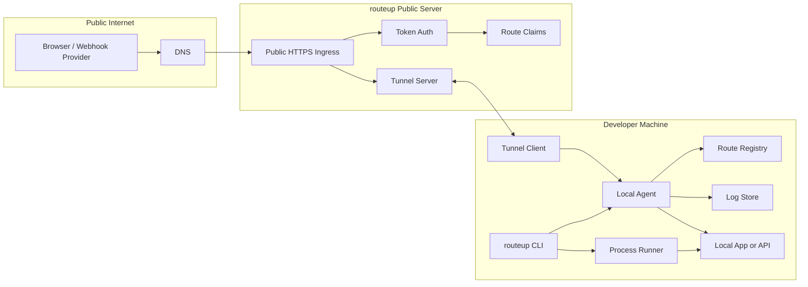

# Architecture

`routeup` has one user-facing binary and four internal systems: CLI, local agent, public server, and tunnel client.

The route is the core object. A route has a dotted name, local hostnames, an optional public hostname, one or more targets, and logs.

## System Diagram



## Main Components

### CLI

The CLI is the normal user surface.

Commands:

```bash
routeup
routeup serve
routeup serve --port 8080
routeup serve --port 8080 --expose
routeup expose <name>
routeup status
routeup routes
routeup logs
routeup doctor
routeup setup
```

Responsibilities:

```txt
parse commands and flags
load config and env vars
infer route names
start child processes
register and unregister routes
start the local agent if needed
start the tunnel client for expose
print clear status and errors
```

### Local Agent

The local agent is the route brain on the developer machine.

Responsibilities:

```txt
listen on local ingress
route by Host and path
terminate local TLS once setup exists
reverse proxy to local targets
hold active route registry
record local and public access logs
own the tunnel client when any claim has expose=true
serve agent API for CLI commands
serve useful error pages for missing routes
```

The agent should start on a high port in early milestones. Later, setup should make no-port HTTPS work on `443`.

CLI-to-agent IPC:

```txt
Transport:   Unix domain socket per user
Path:        ~/.routeup/agent.sock (default), $XDG_RUNTIME_DIR/routeup/agent.sock on Linux when available
Permissions: 0700 directory, 0600 socket
Wire format: JSON over HTTP/1.1
Auth:        filesystem permissions only (no token on the local socket)
Versioning:  /v1/ URL prefix; GET /version returns agent version for friendly mismatch errors
```

Initial API surface:

```txt
POST   /v1/routes               register a route claim
DELETE /v1/routes/{name}        release a claim
GET    /v1/routes               list active routes
GET    /v1/status               agent status, version, uptime, boot id
POST   /v1/shutdown             graceful shutdown (used by `agent stop`/restart)
GET    /v1/logs?route=&follow=  SSE stream of access logs
POST   /v1/expose               start public exposure for a claimed route
POST   /v1/unexpose             stop public exposure
```

The status response carries a `boot_id` generated once per agent process. The
foreground `serve` command registers its claim, remembers that boot id, and
re-registers if the id changes (the agent restarted) or the agent becomes
unreachable. This client-driven reconciliation is why the agent can keep its
registry purely in memory: the live `serve` processes are the source of truth
and re-assert their claims after any agent restart.

### Public Server

The public server is the internet-facing ingress.

Responsibilities:

```txt
accept HTTPS traffic for *.<public-suffix>
authenticate tunnel clients with tokens (when present)
serve the optional public namespace (token-less, session-only claims)
validate token claims against the token's allow patterns
route public requests to active tunnel clients
return clear offline/private/conflict responses
issue and renew wildcard TLS via ACME DNS-01
record edge metadata where useful
```

The hosted server uses `routeup.dev` as its public suffix and enables the public namespace (`try.routeup.dev`). Self-hosted operators set their own suffix and DNS provider, and opt into a public namespace via server config; the code does not hardcode either.

The public server should not be a SaaS control plane in v1. It is a self-hostable ingress server.

### Tunnel Client

The tunnel client is a module of the local agent, not a separate process or user-visible component. It activates whenever an active claim has `expose=true`.

Responsibilities:

```txt
connect outbound to the public server
authenticate with a routeup token
claim one or more public routes
receive request streams from the server
forward those streams to the matching local target
propagate cancellation and timeouts
reconnect with backoff on transient failures
```

Protocol (confirmed):

```txt
github.com/coder/websocket   outer connection over TLS on 443
github.com/hashicorp/yamux   stream multiplexing inside the WebSocket
```

Each public HTTP request becomes one yamux stream end-to-end. WebSocket on 443 looks like normal HTTPS traffic and survives corporate proxies, NAT, and most hotel and mobile networks. This is the same pattern used by `inlets`, `boringproxy`, and `frp`.

Protocol version is prefixed in the WebSocket handshake. Client and server refuse mismatched versions with a clear error.

QUIC is a viable future alternative (the cloudflared model) but adds operational complexity for negligible gain at this scale. Revisit only if WebSocket + yamux proves insufficient.

## Local Request Flow

Without public exposure:

```txt
Browser
  -> https://api.myapp.localhost
  -> local agent
  -> route registry lookup
  -> local target on localhost:<port>
  -> response through local agent
```

No server contact, no token required. This is the zero-network path that `routeup setup` alone enables.

## Public Request Flow

When exposed:

```txt
Webhook provider or external browser
  -> https://api.myapp.routeup.dev
  -> public DNS
  -> routeup public server
  -> token/claim lookup
  -> tunnel stream
  -> local tunnel client
  -> local agent
  -> local target
  -> response returns over the same path
```

## Route Model

Route names are dotted labels:

```txt
myapp
api.myapp
docs.myapp
```

The hostname mapping is mechanical:

```txt
<route>.localhost                local, served by the agent
<route>.<namespace>.routeup.dev  public, requires a token whose allow pattern covers it
<route>.try.routeup.dev          public, no token (ephemeral, when the server enables the public namespace)
```

Do not model `project`, `namespace`, and `service` as separate user concepts until real usage proves they are needed.

Initial route shape:

```txt
name: api.myapp
target: http://localhost:9080
public: exposed or not exposed
```

Later route shape:

```txt
name: myapp
targets:
  /: http://localhost:<dynamic-vite-port>
  /api: http://localhost:9080
public:
  exposed: true
  paths: all or selected patterns
```

## Config Discovery

Config sources, highest precedence first:

```txt
1. CLI flags
2. Environment variables (ROUTEUP_*)
3. Config files
```

Inference is config-driven only: the `name` field in `routeup.json` or the `routeup` block of `package.json` is the project name. There is no CWD-basename or top-level `package.json` `name` fallback.

Config files are looked up in the current working directory only:

```txt
routeup.json                       (preferred)
package.json with a routeup block
```

`routeup.json` wins when both exist in the same directory. Multi-directory walk-up is not implemented in v1 and may be added later when monorepo workflows justify it. Per-language embeds beyond `package.json` (e.g. `pyproject.toml`, `Cargo.toml`) are out of scope for v1 — non-JS projects use `routeup.json` directly.

Bare-name resolution:

```txt
Any argument containing a dot is taken literally.
A bare name is prefixed with the project name from the config.
If no project name is set, a bare name is used as-is.

project = myapp (from routeup.json or package.json routeup.name)
  routeup serve                 -> route myapp
  routeup serve api             -> route api.myapp
  routeup serve api.myapp       -> route api.myapp (literal)
  routeup serve api.other       -> route api.other (literal, not scoped under myapp)
```

## Process Lifecycle

For `routeup` as a runner:

```txt
1. CLI loads config and infers route.
2. CLI starts local agent if needed.
3. CLI chooses a free app port.
4. CLI starts the child command with env vars.
5. CLI registers the route with the local agent.
6. CLI waits for the child process.
7. CLI unregisters the route on exit or signal.
8. CLI exits with the child process exit code.
```

For `routeup serve --port 8080 --expose` (or standalone `routeup expose <name>` on an already-served route):

```txt
1. CLI resolves the route name and target port.
2. CLI starts the local agent if it is not running.
3. CLI calls the agent: register route, target, expose=true.
4. Agent registers the local route and dials the public server.
5. Agent claims the public route over the WebSocket + yamux session.
6. CLI streams status and logs and blocks until Ctrl-C.
7. CLI tells the agent to release the claim.
8. Agent tears down the tunnel for this route, leaving other tunnels unaffected.
```

## Code Layout

Planned layout:

```txt
cmd/routeup/main.go

internal/cli/
internal/config/
internal/route/
internal/ipc/
internal/agent/
internal/agentctl/
internal/proxy/
internal/process/
internal/server/
internal/tunnel/
internal/logs/
internal/certs/
internal/setup/
internal/state/
```

Package responsibilities:

```txt
cli: command tree and command orchestration
config: config/env/package.json discovery
route: route names, host mapping, match rules
ipc: wire types + path constants shared by agent and agentctl
agent: local agent daemon — API handlers, registry, reverse proxy
agentctl: CLI-side stub that talks to the agent over the socket
proxy: reverse proxy behavior
process: child command runner and env injection
server: public ingress, tokens, route claims
tunnel: tunnel protocol and stream forwarding
logs: request log schema and stores
certs: local CA and certificate handling
setup: OS setup orchestration
state: filesystem paths and state-file helpers
```

## State

State should be minimal at first.

Examples:

```txt
config file path
local CA files
trusted setup marker
server URL
token file
agent socket path
bounded log store
```

State files containing secrets must use restrictive file permissions.

## Conflict Resolution

Local conflicts (two claims for the same route on one machine):

```txt
default:   fail closed; the CLI prints the owning pid and cwd
override:  --force transfers ownership and unregisters the previous owner
orphans:   the agent reaps stale claims when the owning pid is gone
```

Loud failure is preferred over silent last-wins. Silent last-wins is a primary source of "why isn't my dev server responding" debugging time.

Public conflicts (two clients claim the same route via the same server):

```txt
default:           409 Conflict; generic message, owner identity is not disclosed
grace window:      30s after a disconnect, the same token may resume the claim
cross-token:       a held route cannot be reclaimed by a different token
public namespace:  session-only, no grace window, first-come-first-served
verbose mode:      self-hosted single-operator servers may opt in to detailed errors
```

Owner identity is never leaked to non-owning clients on the public server.

## Failure Modes

Expected failure modes must have clear messages:

```txt
setup not run
local agent unavailable
route already claimed locally
route already claimed publicly
token missing and server has no public namespace
token outside allowed route scope
target port not reachable
tunnel disconnected
public route offline
path not exposed
```

`routeup doctor` should eventually diagnose most of these.
